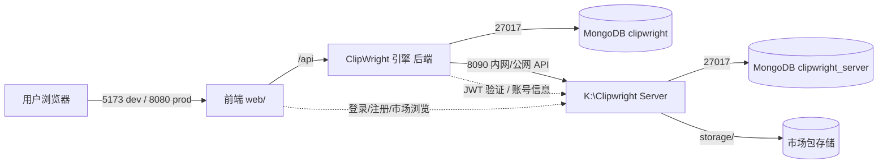

# ClipWright 修复与功能补全计划（开发版）

> 版本：v0.3（待评审；v0.2=对账补录，v0.3=评审决议：包体拆分与参考成片风格模仿纳入排期，E3 项目共享保持排除） · 状态：**仅计划，未经评审批准不得执行**
> 依据：六轮审计（交付就绪度 / 安全与功能 / 特性完整性 / 未文档化缺口 / Persona·类型·插件专项 / 汇总），审计结论共约 230 项问题、完整度约 68%。
> 评审流程：开发/架构负责人逐节评审 → 修改本文档 → 批准后按 §10 执行清单实施。

---

## 1. 范围

### 1.1 包含（本次排期）

| # | 工作块 | 对应审计项 |
|---|--------|-----------|
| 1 | 安全与数据必修（P0/P1 共 11 项） | §2 全部 |
| 2 | 文档-代码-行为对账与死代码清理 | §3（A 组 10 + D 组 9 + 假成功 5） |
| 3 | 工程化：monorepo 合并 + 一键启动 + CI + 端口统一 | 新增 |
| 4 | **账号管理**（服务端在 K:\Clipwright Server，主项目接入） | 新增（落地 B1 多租户） |
| 5 | **Persona 市场 / 插件市场**（主项目仅做前后端；服务端在 K:\Clipwright Server） | F1/F2 落地 |
| 6 | 商用地基（配额/速率/预算/队列/审计/版权过滤/多方案/幂等/硬过滤） | B 组（B1 并入账号管理） |
| 7 | 编辑器专业能力 | M 组 14 项 + 编辑器手感 12 项 |
| 8 | 薄弱项加固 | C 组 11 + W 组 15 |
| 9 | 接线即得 + 运营调度 | 孤儿代码 4 项 + 定时/失败诊断/模板复用/归档 |
| 10 | 素材治理与合规 | 去重/失效巡检/使用统计/违规检测 |
| 11 | Persona/类型/插件治理 | B2–B28 + 插件 P1/P2/P3/M1–M15 |

### 1.2 排除（本次不排期，日后可加回）

| 排除项 | 对应审计条目（加回时按此恢复） |
|--------|-------------------------------|
| 发布分发（封面编辑/智能封面、发布元数据、平台发布、分享链接、发布历史、定时发布、水印产品入口） | §6 发布分发域 7 项 |
| 模板分享（分享到社区） | 前端 F3 |
| 多人协作/评论批注 | 前端 E1 |
| 项目共享审阅链接（评审确认：与多人协作同类，保持排除） | 前端 E3 |
| 多语言成片（脚本翻译→多语言配音→多语言字幕→独立成片） | §6 内容创作辅助-多语言 |
| 数字人/虚拟形象 | §6 内容创作辅助-数字人 |
| A/B 双管线对比 | §6 运营调度-A/B |
| （与排除项联动）平台自动发布合规决策 | business_analysis.md:566 |

> 决策记录 D-01：排除项不影响其前置依赖（如账号体系的 owner 字段照做，因 P3 需要）。

---

## 2. 目标架构

### 2.1 拓扑



### 2.2 端口与约定（统一后）

| 服务 | 端口 | 说明 |
|------|------|------|
| ClipWright 后端 | **8080**（唯一标准） | 删除所有 8000 fallback，文档同步 |
| 前端 dev | 5173 | vite proxy `/api` → 8080 |
| ClipWright Server | 8090 | 账号 + 市场 |
| MongoDB | 27017 | 两个库：clipwright / clipwright_server |

### 2.3 Monorepo 结构（合并后）

```
J:\Clipwright\                     # 合并后的唯一仓库（保留后端 git 历史）
├── clipwright/                    # 后端包（原位不动，相对路径不受影响）
├── personas/ plugins/ PluginData/ renders/ projects/ ...   # 后端运行时目录（原位）
├── web\                           # ← 前端整体迁入（原 J:\Clipweight-Client）
│   ├── src/ e2e/ docs/ ...
│   ├── package.json vite.config.ts ...
│   └── .env                       # VITE_API_BASE_URL=http://localhost:8080
├── docs\                          # 合并后文档（含本计划）
├── scripts\
│   ├── start.ps1                  # 一键启动（开发模式）
│   ├── start.bat
│   ├── stop.ps1
│   └── check_env.ps1              # 环境体检（python/node/mongo 版本与端口）
├── docker-compose.yml             # mongo + 后端 + 前端（生产构建） + server
├── Dockerfile.backend
├── web\Dockerfile.frontend
└── README.md                      # 更新为 monorepo 说明 + 一键启动
```

### 2.4 K:\Clipwright Server 结构（新建，独立 git 仓库）

```
K:\Clipwright Server\
├── app\
│   ├── main.py                    # FastAPI 入口（/health、挂载两路由）
│   ├── config.py                  # pydantic-settings（CLIPWRIGHT_SERVER_ 前缀）
│   ├── auth\                      # 账号管理
│   │   ├── router.py              # register/login/refresh/logout/me/change-password/verify
│   │   ├── service.py             # bcrypt + JWT 签发/校验 + 刷新轮换
│   │   └── models.py              # users 集合模型
│   └── market\                    # 市场
│       ├── router.py              # 插件/Persona 发布·搜索·详情·下载·评分·审核
│       ├── service.py             # 包存储/校验/版本管理
│       └── models.py
├── storage\                       # 市场包存储（gitignore）
├── tests\                         # pytest
├── pyproject.toml · .env.example · .gitignore · docker-compose.yml · README.md
```

---

## 3. 阶段总览

| 阶段 | 内容 | 人日（估） | 前置 | 退出标准（DoD） |
|------|------|-----------|------|----------------|
| **P0** | 安全与数据必修（14 项） | 6–9 | 无 | 全部 P0/P1 修复 + 安全回归测试通过 |
| **P1** | 文档对账与死代码清理 | 1–2 | P0 | 19 项承诺「落地/改文档/标废弃」各有结论；6 个 stub 工具拆除或接真实现 |
| **P2** | 工程化（合并/一键启动/CI/工程卫生） | 4–6 | P1 | 一个仓库、一条命令启动、CI 绿、LICENSE/依赖/残留清理完成 |
| **P3** | 账号管理 | 10–15 | P2 | 注册/登录/JWT/配额可用；主项目 owner 数据隔离生效 |
| **P4** | Persona/插件市场 | 12–20 | P3 | 市场发布/下载闭环；主项目可浏览安装 |
| **P5** | 商用地基（B 组剩余 + Agent 基座 + 用量报表） | 17–29 | P3 | 限流/预算/队列/审计/版权/多方案/幂等/硬过滤/报表上线 |
| **P6** | 编辑器专业能力（26+10 项） | 45–68 | P0 | M 组 14 + 手感 12 + 打磨批 10 全部验收 |
| **P7** | 薄弱项加固（26+4 项） | 46–73 | 可与 P6 并行 | C/W 组全清 + C12/W16/W17/W18 |
| **P8** | 接线即得 + 运营调度（14 项） | 33–53 | P1 | webhook/批量/dry-run 接线；定时/诊断/模板复用/归档/热点/脚本/beat-sync/色彩匹配/参考风格可用 |
| **P9** | 素材治理与合规 | 9–14 | P0 | 去重/巡检/统计/违规检测上线 |
| **P10** | Persona/类型/插件治理 | 18–31 | P0 | B2–B28 与插件 P1/P2/M 全清（含沙箱/签名） |

**合计约 202–322 人日**（P6/P7 可并行压缩工期；v0.2 补录 30 项 + v0.3 决议新增 2 项）。

---

## 4. 阶段明细

### P0 · 安全与数据必修（11 项，5–8 人日）

| # | 任务 | 修改点（文件） | 验收标准 |
|---|------|---------------|---------|
| P0-1 | asset 任意文件读取链封堵 | `api/asset.py:176-187` 增加 `assert_allowed_path`；`services/asset_manager.py:89-135` import_file 二次校验；`api/asset.py:135-142` get file/thumbnail 返回前校验 `asset.file_path` | 传 `.env` 路径 import-path 返回 400；越界 file 请求 400 |
| P0-2 | 渲染入参白名单 + 输出路径安全 | `api/render.py:258-290` 输出改 `is_safe_download_name + safe_join(renders_dir)`；`services/render.py:739,1332-1359` 对 asset_id/audio/bgm 解析后路径 `assert_allowed_path` | `renders/../../x.mp4` 拒绝；任意音频/素材路径拒绝 |
| P0-3 | ffmpeg filter 注入 | `schema/timeline.py:110-112` transition_in 改枚举/白名单；`render.py:830-832` 拼接前校验；keyframes 数值强制化；drawtext fontfile 白名单+转义（round2 P3 项并入） | 非法 transition 值 422/400；fuzz 用例通过 |
| P0-4 | tool 执行入口校验 | `api/tool.py:21-33` 入口统一 `assert_allowed_path`（input/output 类参数）+ 工具级参数白名单 | 越界路径 400 |
| P0-5 | **Persona 保存毁参（B1）** | 前端 `types/persona.ts` 与后端 `schema/persona.py` 统一字段名（9 组映射，后端加 alias 或前端映射层）；`PersonaDetailPage.tsx:116-131` 回传字段对齐 | 保存前后 `parameter.yaml` 自定义值不变；单测覆盖 9 组字段往返 |
| P0-6 | Mongo `_io` 持久化误用族 | `services/mongodb_service.py` 模型方法显式 async 化（或调用点强制 await）；至少修 4 处：`requirements_service.py:304`（TTL 清理）、`:404/:415`（会话恢复）、`:1446`（process_upload）、`pipeline_v2.py:242`（find_many） | 新增 async 集成测试：会话重启恢复、TTL 清理真实删库、/runs 返回 Mongo 历史 |
| P0-7 | import-url SSRF + 内存限制 | `api/asset.py:190-213` 下载前 `assert_public_url`；流式写盘 + 大小上限（参考 worker/_HashingWriter） | 内网/回环 URL 拒绝；超大文件 413 |
| P0-8 | ChromaDB 导入期副作用 | `api/rag.py:13` 模块级 Retriever 改懒加载单例（首次使用时初始化，失败降级） | 删除/损坏 `.chroma_db` 后服务仍可启动，RAG 端点返回明确错误 |
| P0-9 | SSE 鉴权（后端） | `main.py:214-239` 为 SSE 路径支持短期一次性 query token（签发端点 + 日志抹除含失败路径） | token 模式下 EventSource 全链路可用；token 不进访问日志 |
| P0-10 | 前端认证统一 | `render.ts:62-77` 下载/流改 axios 带凭据；`EditorPage.tsx:265` pagehide 冲刷、`mediaManager.ts:275` 波形改带 Authorization；补 `cw:unauthorized` 全局监听（toast+跳转） | 开启 token 后渲染进度/下载/自动保存/波形全部正常 |
| P0-11 | 端口统一 + E2E 闭环 | 所有 fallback 改 8080（`client.ts:9`、`settingsStore.ts:68` 默认改空串、各 URL builder）；`e2e/integration.spec.ts:3` 改 8080 并移出默认 testDir（新增 `test:e2e:integration`）；`.env.example`/AGENTS.md/README 同步 | `npm run test:e2e` 默认全绿（hermetic）；integration 单独脚本在 8080 后端就绪时全绿 |
| P0-12 | persona knowledge doc.id 校验（round2 P2-3 补录） | `api/persona.py:123-129` 对 doc_id `validate_id`；`repository.py:188-190` 写文件路径经校验 | 非法 doc_id 400；越界 .md 写入被拒 |
| P0-13 | 错误响应脱敏（round2 P2-10 补录） | ffmpeg stderr / `str(e)` 回显处（`api/render.py:71` 等）统一脱敏：过滤服务器绝对路径后回传 | 错误响应不含服务器路径 |
| P0-14 | 请求体上限 + 管理端点鉴权（round2 P2-9/P3 补录） | 中间件限请求体大小（如 20MB）；`/metrics`、`/test` 挂载加 token/JWT 保护 | 超大 body 413；未鉴权访问 /metrics 401 |

> 安全红线：生产部署强制 `CLIPWRIGHT_API_TOKEN`（或 P3 后的 JWT）；启动检测无鉴权配置时禁止以 0.0.0.0 公网暴露（警告升级为错误或显式开关）。

### P1 · 文档对账与死代码清理（1–2 人日）

| 任务 | 处理原则 |
|------|---------|
| A 组 10 项 + D 组 9 项 | 每项三选一：**落地**（排期到对应阶段，如 A1 动画并行并入 P7）/ **改文档**（声明当前行为）/ **标废弃**（在文档中标记 removed） |
| 假成功 5 项 | 对话式编辑（EditSession 死代码）→ 本计划**删除**（能力由时间线+Agent 返工替代）；ShotIntent → 改文档为「未实现，规划中」；TimelineVersionStore → 接线到 P6 版本历史 UI；FrameValidatorTool/TextDesignTool/VideoFilterTool 等 6 个 stub → 返回 `ToolStatus.NOT_IMPLEMENTED` 并附文档链接，或接真实现 |
| parity 文档 | 重跑 §6 复现命令更新路由数（requirements 8、asset 9） |
| 参考成片风格模仿 | 已排入 P8（评审决议 v0.3），此处不再做三选一处理 |
| 300+ 裸 except 治理（round2 P3 补录） | 制定策略：核心路径（持久化/清理/渲染）在 P0/P7 强制消除；外围降级型 except 登记豁免清单 |

### P2 · 工程化：Monorepo 合并 + 一键启动 + CI（3–5 人日）

**2.1 仓库合并（执行步骤，批准后按此操作）**

```powershell
# 方案 A：保留前端提交历史（推荐）
cd J:\Clipwright
git remote add web-tmp J:\Clipweight-Client
git fetch web-tmp main
git subtree add --prefix web web-tmp main --squash
git remote remove web-tmp

# 方案 B：仅合并当前快照（历史留在原仓库，操作更简单）
robocopy J:\Clipweight-Client J:\Clipwright\web /E ^
  /XD node_modules dist .git .pytest_cache .ruff_cache test-results ^
       frames renders projects personas PluginData .codegraph .omo ^
       .opencode .playwright-mcp
```

- 后端文件全部原位（`clipwright/`、`personas/`、`plugins/` 等不移动，避免相对路径爆炸）。
- 前端迁入 `web\`；`web\.gitignore` 补充 frames/projects/renders/personas/PluginData/.pytest_cache/.ruff_cache。
- 合并后原 `J:\Clipweight-Client` 置为只读归档（不删除，直至 CI/联调确认）。
- `docs\frontend-backend-parity.md` 等文档路径引用统一更新为 `web/`。

**2.2 一键启动**

- `scripts\check_env.ps1`：检查 python≥3.12、node≥20、MongoDB 27017 监听、端口 8080/8090 空闲。
- `scripts\start.ps1`（开发模式）：
  1. 运行 check_env；
  2. 若 `web\node_modules` 缺失 → `npm ci --prefix web`；
  3. 后端：`Start-Process python -ArgumentList '-m','clipwright.main'`（隐藏窗口，日志写 `logs/backend.log`）；
  4. 前端：`npm --prefix web run dev`（前台，Ctrl+C 退出）；
  5. （P3 后）Server：若启用账号/市场 → 一并拉起 `uvicorn app.main:app --port 8090`。
- `scripts\start.bat`：等价批处理（双击启动）。
- `scripts\stop.ps1`：按端口 8080/5173/8090 结束进程。
- 生产模式：`docker-compose up`（见 2.3）或 `npm --prefix web run build` 后由后端 `StaticFiles` 挂载 `web\dist`（单进程）。

**2.3 docker-compose.yml**

```yaml
services:
  mongo: { image: mongo:7, ports: ["27017:27017"], volumes: [mongo_data:/data/db] }
  backend:
    build: { context: ., dockerfile: Dockerfile.backend }   # python3.12 + clipwright + ffmpeg
    ports: ["8080:8080"]
    depends_on: [mongo]
    volumes: ["./renders:/app/renders", "./personas:/app/personas", "./PluginData:/app/PluginData"]
    env_file: [.env]
  frontend:
    build: { context: ./web, dockerfile: Dockerfile.frontend }  # node build → nginx，proxy /api→backend:8080
    ports: ["80:80"]
  server:   # P3/P4 完成后启用
    build: { context: ../Clipwright Server 或独立部署, dockerfile: Dockerfile }
    ports: ["8090:8090"]
```

**2.4 CI（GitHub Actions / Gitea 均可）**

- 后端：`python -m pytest` + `ruff check`；前端：`npm run typecheck && npm run test && npm run lint && npm run test:e2e`（hermetic）；每 PR 必跑。
- 发布门禁：P0 安全回归用例（越界路径/SSRF/filter 注入）必须包含。

**2.5 工程卫生批（0.5–1 人日，补录）**

| 任务 | 来源 | 要点 |
|------|------|------|
| LICENSE 文件 | 合规审计 | 两仓库补 LICENSE（MIT）+ README「开源协议」章节 |
| persona 个人数据出库 | 合规审计 | `git rm --cached personas/`（26 文件）+ .gitignore + 历史清理评估 |
| isobase 锁版本 | round2 P2-8 | pyproject 改为锁定 commit/tag 或私有索引镜像 |
| opencode-autopilot 归位 | 前端 P2-5 | 移出 dependencies → devDependencies（或移除） |
| 根目录调试残留清理 | 前端 P3 | e2e-*.png/json、ux-*.png、web_search_tool.py、_xtest/envx 清理/归档 |
| index.html 安全头 | 前端 P3 | 补 CSP / Referrer-Policy meta（部署层同配） |
| Giphy demo key 移除 | 插件审计 | `plugins/gif_sticker/main.py:20` 删除硬编码默认值 |

### P3 · 账号管理（10–15 人日）

**3.1 K:\Clipwright Server 服务端（3A，6–8 人日）**

API 规格（v1，全部 JSON，除标注外均需 Bearer JWT）：

| 端点 | 方法 | 说明 | 权限 |
|------|------|------|------|
| `/api/auth/register` | POST | 邮箱+密码注册（密码强度校验、邮箱唯一、bcrypt） | 匿名 |
| `/api/auth/login` | POST | 返回 access_token + refresh_token；**登录失败速率限制**（5 次/5 分钟/IP+账号） | 匿名 |
| `/api/auth/refresh` | POST | refresh_token 轮换（旧 token 立即失效） | 匿名 |
| `/api/auth/logout` | POST | 撤销 refresh token | 登录 |
| `/api/auth/me` | GET | 用户资料 + 配额用量 | 登录 |
| `/api/auth/change-password` | POST | 修改密码（需旧密码） | 登录 |
| `/api/auth/verify` | POST | 主项目内网验证 JWT（返回 user_id/role/quotas） | 服务互信（共享密钥或仅内网） |
| `/api/admin/users` | GET/PATCH | 列表/禁用/调整配额 | admin |

数据模型（users 集合）：`email, password_hash, display_name, role(user|admin), status(active|disabled), quotas{storage_bytes, render_seconds, pipeline_runs}, usage{...}, refresh_tokens[], audit[] , created_at, updated_at`。
安全要求：JWT HS256（`CLIPWRIGHT_SERVER_JWT_SECRET` 强制非默认值启动）、access 1h / refresh 30d 轮换、审计事件（注册/登录/改密/配额变更）写 audit 集合。
初始化：git init + 骨架（结构见 §2.4）+ 初始提交。

**3.2 主项目接入（3B，4–7 人日）**

| 任务 | 修改点 |
|------|--------|
| 配置 | `config.py` 增加 `account_url`、`account_verify_mode(token|jwt|off)`；`jwt_secret`（共享验证） |
| 鉴权中间件升级 | `main.py:214-239`：off=现状；jwt=本地验签（共享密钥）；token=内网调 `/api/auth/verify`。SSE 短期一次性 token 签发端点（P0-9 落地于此） |
| owner 数据隔离 | projects/pipelines/personas/renders 增加 `owner_id`；所有查询/下载按 owner 过滤；管理接口仅 admin |
| 前端会话 | 登录页（新增路由 `/login`）；access token 存内存 + refresh 存 httpOnly cookie（不再 localStorage 明文，替换 P2-4 遗留）；`cw:unauthorized` → 自动 refresh → 失败跳登录 |
| 兼容 | 本地/内网部署保持 `off` 模式（现 token 模式保留为过渡） |

**验收**：两账号数据互不可见；token 过期自动续期无感；登录限流生效；SSE 在 JWT 模式全链路可用。

### P4 · Persona / 插件市场（12–20 人日）

分工：**主项目 = 市场前端（浏览/发布向导）+ 后端 market client 与本地安装/导入；Server = 存储、发布、下载、审核 API。**

**4.1 Server 市场 API（4A，6–9 人日）**

| 域 | 端点 | 说明 |
|----|------|------|
| 插件 | `POST /api/market/plugins` | 发布（multipart 包 + manifest 校验） |
| 插件 | `GET /api/market/plugins?q=&tag=&page=` | 搜索/筛选 |
| 插件 | `GET /api/market/plugins/{id}` · `/{id}/versions` | 详情/版本 |
| 插件 | `GET /api/market/plugins/{id}/download` | 下载（计数+1，限速） |
| 插件 | `POST /api/market/plugins/{id}/rating` | 评分/评价 |
| 插件 | `GET /api/market/plugins/pending` · `POST /{id}/approve|reject` | 审核队列（admin） |
| Persona | 同构一组 `POST/GET/GET{id}/download/rating` | 发布=persona 目录打包（manifest 校验） |

包规范：tar.gz；必需 manifest（id/name/version/license/compat_api_version/author）；发布时服务端计算 sha256；单包 ≤200MB；解包后结构校验（插件=plugin.yaml+入口模块；Persona=persona.yaml 可被主项目 schema 解析）；预留审核流与病毒扫描接口（可选集成 ClamAV）。

**4.2 主项目后端（4B，3–5 人日）**

- `services/market_client.py`：封装 Server API（httpx，超时/重试/错误归一）。
- `services/install_service.py`：安装流程 = 下载 → sha256 校验 → 解包到临时目录 → 结构/manifest 校验 → 原子移动到 `plugins/{id}/` 或 `personas/{id}/` → 注册/导入 → 失败回滚（删除半成品 + 事件日志）。
- 安全：下载 URL 必走 `assert_public_url`；解包防 zip-slip（路径校验）；安装前冲突检测（P10 的 unregister/冲突机制先落地最小版）。

**4.3 主项目前端（4C，3–6 人日）**

- 新增 `/market` 页（Tab：插件 / Persona）：搜索、列表、详情（版本/评分/兼容性）、安装/导入按钮（状态：已安装/可更新）。
- 发布向导：选择本地插件目录或 persona → 打包上传 → 进度/结果。
- 设置页与 PluginsPage 增加「市场」入口；`VITE_ENABLE_*_MARKET` 开关改为真实生效。

**验收**：发布一个测试插件/Persona → 另一账号搜索下载安装成功；恶意包（路径穿越/超限/假 manifest）被拒绝且日志留痕；安装失败可回滚。

### P5 · 商用地基（B 组剩余，15–25 人日，依赖 P3）

| 任务 | 来源 | 方案要点 |
|------|------|---------|
| 速率限制 | B2 | 自研轻量中间件（滑动窗口，按 user/ip/端点），限额进 users.quotas |
| 成本预算熔断 | B3 | LLM 用量累加（先修 P0-6 持久化 + C2 成本追踪）→ 超月预算拒绝新管线并通知 |
| 队列持久化+优先级 | B4 | 任务/渲染队列落 Mongo，重启恢复；优先级字段 |
| 审计日志 | B5 | audit 集合：管线/渲染/review/安装/配置变更；review accept/reject 落库（C7 一并做） |
| 版权/敏感过滤 | B6 | 素材加 license/source 字段透传；敏感词过滤作为可选服务（先出接口） |
| 多方案生成 | B7 | structure 双稿 + 质量分择优（低置信场景） |
| 幂等键 | B8 | 请求指纹去重（管线/渲染入口） |
| 素材硬过滤 | B9 | 时长/分辨率门槛（按视频类型可配） |
| Agent 统一基座（补录） | Agent 缺失 | base 统一重试/超时/预算基座；animation 动画预算/复杂度上限；quality 渲染产物级校验（黑帧/花屏/音画不同步） |
| 用量报表（补录） | §6 报表 | 用户可读用量/费用报表 API + 前端入口 |

### P6 · 编辑器专业能力（41–62 人日）

**6.1 M 组 14 项**

| 组 | 任务（审计 ID） |
|----|----------------|
| 剪辑核心 | M1 ripple/rolling/slip/slide 编辑族；M2 素材编组；M4 蒙版；M5 时间重映射；M11 转场可见性（预览+时间轴渲染） |
| 音频 | M6 音频增益+淡入淡出 UI；M7 轨道隐藏/独显 |
| 工作流 | M3 跨项目复制/粘贴属性；M8 标记持久化+命名；M9 素材删除/替换 UI；M12 In/Out 区间 UI；M13 编辑器内 Persona 切换 |
| 死状态 | M14 范围选择工具（实现或移除按钮）；M10 吸附快捷键 |

**6.2 编辑器手感 12 项**：画布双击编辑文字（C1）、波形拖拽增益（C2）、嵌套序列（C3）、快捷键自定义 UI（C4）、画布设置修改（C5）、自定义导出预设（C6）、代理工作流 UI（C7）、版本历史 UI（G1，接线后端 TimelineVersionStore）、多标签同步（G3）、项目排序（A1）、回收站/软删除（A2）、模板画廊（A3）。

**6.3 产品化打磨批（4–6 人日，补录）**：无 404 路由（notFoundRoute，前端 P2-3）、上传大小客户端预检（统一 MAX_UPLOAD，前端 P2-2）、ProjectCard kebab 删除二次确认、icon-only 按钮 aria-label、window.prompt 替换为弹层输入、自动保存增量 PUT（替换 5s 全量）、onboarding 首启引导（round4 D1）、反馈/报错上报入口（round4 D2）、系统通知中心（round4 E2，持久通知）、PWA/离线缓存（round4 G2）。

### P7 · 薄弱项加固（43–67 人日，可与 P6 并行）

- 后端 C 组 11 项：C1 断点续跑落库、C2 成本追踪真实写入、C3 质检深度默认策略、C4 snapshot 逐 agent、C5 细粒度进度、C6 附件图片理解、C7 review 落库（并入 P5 审计）、C8 熔断健康探测、C9 取消即时性、C10 版本管理接线、C11 BGM 真实混音/LUFS。
- 前端 W 组 15 项：W1 需求流式消费、W2 建议列表（并入 agentStore 死状态清理）、W3 删死客户端、W4 关键帧值编辑、W5 demo 与真实模式显式分离、W6 VideoEditorPage 定位决策（合并或下沉为调试工具）、W7 撤销历史列表、W8 per-route 错误边界、W9 删 wsUrl、W10 LLM 流式、W11 BGM 素材源、W12 区域级返工、W13 by-path 白名单、W14 asset 客户端补全、W15 parity 更新。
- 补录：C12 `_mix_audio` 静默吞异常→静音成片（`services/render.py:1348-1359`，失败必须标记 result 并告警，round2 P2-6）；W16 mediaManager 缓存 LRU 上限（落实 `VITE_MAX_THUMBNAIL_CACHE_SIZE`，前端 P2-9）；W17 historyStore 增量/diff 快照（替换全量 structuredClone，前端 P2-10）；W18 包体优化（评审决议 v0.3：react-query/router 拆 vendor chunk + lucide 图标按需引入，前端 P3 意见项转正式，1–2 人日）。

### P8 · 接线即得 + 运营调度（22–34 人日）

| 任务 | 来源 | 要点 |
|------|------|------|
| webhook 事件接线 | 孤儿代码 | `dispatch_event` 接入 pipeline/render 完成·失败事件（SSRF/HMAC 已有） |
| 批量选题生成 | 孤儿代码 | `template.py:164 batch_generate` 补 API + 前端批量入口 |
| dry-run 预览模式 | 孤儿代码 | `dry_run` 字段接线：只生成规划书不执行渲染 |
| 特效工具产品化 | 工具接线 | 抠像/稳定/水印接入素材右键菜单与导出页（发布分发域的水印入口除外，仅工具级） |
| 定时调度 | §6 运营 | 轻量调度器（Mongo 定时任务 + 后台循环） |
| 失败诊断报告 | §6 运营 | 失败 run 生成结构化诊断（阶段/原因/建议） |
| 管线配置模板复用 | §6 运营 | 保存/加载 PipelineRequest 模板 |
| 项目归档 zip 导出 | §6 归档 | 时间线+素材打包 |
| webhook secret 加密 + TOCTOU（补录） | round2 P2-7/P2-2 | `webhooks.json` 加密落盘；投递固定已验证 IP（自定义 transport）或出站防火墙 |
| 热点/选题发现（补录） | §6 创作辅助 | 可选 trending 数据源 + 选题推荐接口 |
| 脚本续写/改写/扩写（补录） | §6 创作辅助 | LLM 工具化（改写/扩写/缩写三模式） |
| 节拍对齐剪辑 beat-sync（补录） | §6 创作辅助 | 消费 `cut_on_beat`：EditAgent 按 BPM 拍点对齐切点 |
| 跨片段色彩匹配（补录） | §6 创作辅助 | 以参考片段为基准自动匹配（color_correct 扩展） |
| 参考成片风格模仿（评审决议 v0.3 补入） | §6 创作辅助 | 上传参考视频 → 提取配色/镜头节奏/转场风格参数 → 写入 persona 参数层（6–10 人日） |

### P9 · 素材治理与合规（9–14 人日）

素材库哈希去重（import_file 内容哈希比对）、URL 失效巡检（定期 404 检测+标记）、素材使用统计（used_count）、违规内容检测（接口 + 可选第三方服务）。

### P10 · Persona/类型/插件治理（16–27 人日）

| 块 | 任务（审计 ID） |
|----|----------------|
| Persona 高优 | B2 forge logger、B3 异常归一 404、B5 ChatForge 会话落盘、B6 删除级联向量、B7 原子写、B8 变量修复、B14 RAG 字段修复（0.1 人日级优先合入 P0 后的第一个批次） |
| Persona 其余 | B4/B19 覆盖冲突 409、B10 知识文档 DELETE/PUT（含重索引异步化，round2 P2-4/5 一并落地）、B11/B12/B13/B15/B17/B18/B20/B25/B26/B27/B28 + P3 七项；补录：B16 persona_learner（接线到编辑事件上报，或删除并改文档）、Persona 删除 UI/复制·派生·导出·导入（前后端）、知识库文档管理 UI（删/改/重命名）、TypeMakerPage 预览调用+删除类型确认、RAG 查询/编码 offload（to_thread，round2 P2-4）、fontconfig 存在性 oracle 收敛（round2 P3） |
| 类型 | B9 前端真字段、B21 transform 实现、B22 校验补全、B23 引用检查、B24 热注册回滚、B29/B31/B35 |
| 插件 | P1-1 注册表 unregister API + 卸载清理；P1-2 冲突检测（注册前查重告警）；P1-3 import 期注册改 initialize；P1-4 hook 执行框架（接 render/pipeline 生命周期）；P1-5 reload 失败回滚+错误传播；P1-6 diagram_style 约定兼容；P1-7 密钥加密存储+前端掩码 |
| 插件治理 | M1 沙箱/签名（市场开放前最低：manifest 签名 + 安装确认 + 权限声明；进程级沙箱作为后续项）、M2 依赖解析、M3 冲突检测、M4 reload 清 sys.modules、M7 错误通道、M8 启停持久化、M10 manifest 增强、M14 审计日志、M15 配置迁移；P2 六项；补录 M11 插件 UI 控件集扩充、M12 设置页插件 UI 预览、M13 未加载插件预配置 |

---

## 5. 数据模型变更汇总

| 库 | 集合/字段 | 变更 |
|----|-----------|------|
| clipwright | projects/pipelines/personas/renders | +`owner_id`（P3）+索引 |
| clipwright | audit（新） | 管线/渲染/review/安装/配置事件（P5） |
| clipwright | task_queue（新） | 持久化队列（P5-B4） |
| clipwright | 素材 | +`license`/`source_url`/`sha256`/`used_count`/`status`（P5-B6、P9） |
| clipwright_server | users（新） | 见 §3.1 |
| clipwright_server | market_plugins / market_personas / ratings / downloads / audit（新） | §4.1 |

---

## 6. 测试与验收

1. **安全回归套件（P0 起强制）**：越界路径 400、SSRF 拒绝、filter 注入拒绝、JWT 过期/篡改、owner 越权 403。
2. **async Mongo 集成测试**：覆盖 P0-6 四误用点，防回归。
3. **市场流程 E2E**：发布→审核→下载→安装→卸载残留检查。
4. **一键启动验收**：干净机器按 `start.ps1` 从零启动 ≤ 5 分钟（含依赖安装指引）。
5. **性能红线**：时间轴 500 clip 60fps 引擎帧率 ≥ 30fps（P6 手感项附带）。
6. 每阶段 DoD = §3 总览表退出标准 + 相关回归测试绿 + 文档同步（AGENTS/README/parity）。

## 7. 风险与决策记录

| # | 风险/决策 | 结论 | 备选 |
|---|-----------|------|------|
| D-01 | 排除项（v0.3 评审决议） | 模板分享/多人协作/多语言成片/数字人/A-B 对比/发布分发 + 项目共享审阅（E3，与协作同类）**保持排除**；包体拆分与参考成片风格模仿**纳入排期**（P7 W18 / P8） | 条目保留索引，日后可加回 |
| D-02 | 插件沙箱 | 首版=签名+权限声明+安装确认；进程级沙箱后置 | 子进程/容器运行插件（成本高） |
| D-03 | JWT 验证模式 | 共享密钥本地验签为主，/verify 端点兜底 | 统一走 Server 验证（多一跳） |
| D-04 | 仓库合并 | subtree 保留前端历史；后端原位不动 | robocopy 快照合并 |
| D-05 | 端口 | 8080 唯一标准，8000 全部清除 | 全改 8000 |
| D-06 | VideoEditorPage（W6） | 下沉为开发者调试工具，不进主编辑器（避免两套模型长期并存） | 完整整合（5-10 人日） |
| D-07 | 平台发布 | 不在本期（排除项）；未来若做，先出发布包导出而非 API 直发（封禁风险，business_analysis.md:566） |

---

## 8. 执行清单（批准后按序执行；含 git 操作）

1. **P2 前置动作**：K:\Clipwright Server 建仓（mkdir → git init → 骨架代码 → .gitignore/.env.example → 初始提交）。
2. 合并前端入 `J:\Clipwright\web`（§4.2.1 方案 A/B 二选一，批准时圈选）→ 提交。
3. 根目录脚本/CI/docker-compose → 提交。
4. 按 P0 → P1 → P3 → P4 → P5 →（P6/P7 并行）→ P8 → P9 → P10 顺序开发；每阶段完成即提交并跑对应回归。
5. 全部完成后：更新 README/AGENTS/parity → 打 tag `v0.2.0-deliverable`。

> ⚠ 本计划为只读评审版；在获得评审批准（或修改后批准）前，不得执行任何代码修改、目录创建或 git 操作。

---

## 9. 修订记录

### v0.2 — 对账补录（六轮审计全覆盖核查）

核查结论：初版覆盖约 85%，遗漏 30 项已全部补入（下为对账表）；另有 2 项为决策边界，需评审确认。

| 来源 | 遗漏条目 | 补入位置 |
|------|---------|---------|
| round2 P2-3 | persona knowledge doc.id 未校验（任意 .md 写/读） | P0-12 |
| round2 P2-4/5 | RAG 同步阻塞事件循环 + _reindex 全量重建 | P10（B10 重索引异步化合并） |
| round2 P2-6 | _mix_audio 静默吞异常 → 静音成片 | P7 C12 |
| round2 P2-7 | webhook secret 明文落盘 | P8 |
| round2 P2-2 | webhook DNS-rebinding TOCTOU | P8 |
| round2 P2-8 | isobase git 依赖未锁 | P2 2.5 |
| round2 P2-9 | /metrics /test /docs 未受鉴权 | P0-14 |
| round2 P2-10 | ffmpeg stderr/str(e) 回显泄露路径 | P0-13 |
| round2 P3 | fontconfig 存在性 oracle | P10 |
| round2 P3 | 请求体无大小限制 | P0-14 |
| round2 P3 | drawtext fontfile 未转义 | P0-3（并入） |
| round2 P3 | 300+ 裸 except | P1（治理策略） |
| 前端 P2-2 | 上传无大小校验 | P6.3 |
| 前端 P2-3 | 无 404 路由 | P6.3 |
| 前端 P2-5 | opencode-autopilot 依赖位置 | P2 2.5 |
| 前端 P2-9 | mediaManager 缓存无上限 | P7 W16 |
| 前端 P2-10 | historyStore 全量 clone | P7 W17 |
| 前端 P3 | 根目录调试残留 / kebab 删除确认 / aria-label / CSP / window.prompt / 5s 全量 PUT | P2 2.5 + P6.3 |
| round4 前端 D1/D2 | onboarding / 反馈上报 | P6.3 |
| round4 前端 E2 | 系统通知中心 | P6.3 |
| round4 前端 G2 | PWA/离线缓存 | P6.3 |
| round4 后端 | 热点选题 / 脚本续写改写 / beat-sync / 色彩匹配 | P8 |
| round4 后端 | 用量报表 | P5 |
| round4 后端 | 参考成片风格模仿 | P1（三选一） |
| round5 | B16 persona_learner 死代码 | P10 |
| round5 | Persona 删除/复制·导出·导入 UI 与端点、知识库文档管理 UI、TypeMakerPage 预览+删除确认 | P10 |
| round5 | 插件 M11 控件集扩充 / M12 UI 预览 / M13 未加载预配置 | P10 |
| Agent 层 | base 统一基座 / animation 预算 / quality 产物级校验 | P5 |
| 合规审计 | LICENSE 文件 / persona 数据出库 / Giphy demo key | P2 2.5 |

**决策边界（评审决议 v0.3）**：
1. **E3 项目共享审阅链接**：评审确认保持排除（与多人协作同类）。✅ 已定
2. **包体拆分（前端 P3 意见项）**：评审决定纳入排期 → P7 W18（1–2 人日）。✅ 已补入
3. **参考成片风格模仿**：评审决定纳入排期 → P8（6–10 人日），P1 三选一处理取消。✅ 已补入

### v0.3 — 评审决议

- 排除项维持：模板分享、多人协作、项目共享审阅（E3）、多语言成片、数字人、A/B 对比、发布分发。
- 新增排期：P7 W18 包体优化（+1–2 人日）；P8 参考成片风格模仿（+6–10 人日）。
- 合计更新：约 202–322 人日。

---

## 10. ִ行进度（批准后滚动更新）

### 已完成（2026-08 执行轮次 1）
- ? P2 前置：K:\Clipwright Server 建仓（commit 0d973a5：auth+market 骨架 18 文件，/health 可用，业务端点 501 待 P3/P4）
- ? P2 合并：前端 git subtree 并入 web/（221806e，保留历史）；根 scripts/start.ps1·bat、check_env、stop、docker-compose、Dockerfile.backend、web/Dockerfile.frontend+nginx、CI（8412751）→ 一键启动：scripts\start.ps1
- ? P0 全部 14 项实施：
  - b249f7b：P0-1 asset 白名单（import 拒绝点文件/白名单外复制/服务端校验）、P0-2 渲染入参白名单+输出 safe_join、P0-3 transition 枚举+注入回退、P0-4 tool 路径参数校验、P0-7 import-url SSRF+流式限流、P0-8 RAG 懒加载、P0-9 SSE 一次性 token（/api/auth/sse-token + 日志抹除）、P0-12 doc.id 校验、P0-13 错误脱敏、P0-14 body 上限+/metrics /test 鉴权
  - df5a776：P0-5 Persona 前后端字段映射（后端兼容校验器+UI 字段；前端 personaFromBackend）、P0-6 _io 四误用点 to_thread 修复
  - 前端批次：persona shape 映射接入 personaApi.get、SSE 挂接异步化（AgentPanel/ExportPage + sse.ts）、下载改 axios blob 带凭据、pagehide/波形裸 fetch 补 Authorization、cw:unauthorized 全局监听、端口统一 8080（client/settingsStore/URL builders/.env.example/AGENTS.md）、integration.spec 移出默认 E2E + 新脚本 test:e2e:integration
- 回归验证：后端 pytest 1005/1005 ? · 前端 261/261 ? · typecheck ? · build ? · hermetic E2E 45/45 ?

### 待办
P1 文档对账 → P3 账号管理（Server 3A + 主项目 3B）→ P4 市场 → P5 → P6/P7 → P8 → P9 → P10

### 执行轮次 2（P1 + P3-3A）
- ? P1 文档对账：19 项承诺逐项三选一落地（workflow.md/structure.md/services_overview.md 标注 A1/A2/A3/A4/A6/A9/A10；requirements_service docstring A8；README 快捷键修正 D9）
- ? P1 假成功清理：对话式编辑死代码删除（services/video_editor.py，-404 行）；frame_validator/black_frame_detect/audio_silence_detect/whisper_transcribe/subtitle_overflow 切换为真实实现注册；video_filter/text_design 假 stub 摘除；A7 fatal 错误分类落地
- ? P1 parity 更新：requirements 7→8（含 /edit）、asset 8→9（含 /by-path）
- ? P3-3A Server 账号核心实现（K:\Clipwright Server commit 325bb76）：register/login/refresh 轮换/logout/me/change-password/verify + /api/admin/users；bcrypt（72 字节上限）+ JWT + 登录限流（5 次/5 分钟）+ 审计事件；7 个 pytest 全过（Mongo 不可用自动跳过）
- 回归：后端 1005/1005 ?

### 执行轮次 3（P3-3B 主项目接入）
- ? 三模式鉴权：config 增加 account_verify_mode(off/token/jwt)/account_url/account_jwt_secret；中间件 jwt 模式本地验签（共享密钥）+ 运维令牌兼容 + request.state 身份注入；SSE 一次性 token 端点适配 jwt 模式
- ? owner 数据隔离：clipwright/authz.py（current_user_id/enforce_owner/filter_by_owner）；项目全 CRUD + 缩略图/复制/重命名/标签所有权校验，list 按 owner 过滤（jwt 模式遗留无主数据隐藏，安全优先）；Persona create 记录 owner、update/delete 校验（读取保持公开）
- ? 前端会话：authStore（access 内存 + httpOnly cookie 刷新）、session 单例、client 拦截器、/srv 代理、LoginPage + /login 路由、App 挂载恢复会话 + 401 自动 refresh→失败跳登录、波形/pagehide 裸 fetch 令牌兼容
- ? Server 端：login/register/refresh 写 httpOnly cookie（cw_refresh，SameSite=Lax），refresh 支持 cookie，logout 清 cookie
- ? 新增测试：backend tests/clipwright/test_authz.py（7 个：401/放行/伪造密钥/owner 隔离/persona 越权/admin 绕过）；Server 既有 7 个适配
- 回归：后端 1012/1012 ? · Server 7/7 ? · 前端 261/261 + typecheck ?

### 执行轮次 4（P3-3B 收尾 + P4 市场后端）
- ? 管线 owner：run-async 记录归属、/runs 按 owner 过滤（jwt 模式无主记录隐藏）、status/retry/cancel 校验所有权
- ? 渲染 owner：queue 记录 owner_id、状态查询校验、列表过滤
- ? P4-4A Server 市场核心（K:\Clipwright Server）：插件/Persona 发布（multipart+tar 校验+sha256）、搜索（仅 approved）、详情（含评分汇总）、下载（计数+1）、评分（每用户每包一评）、admin 审核 approve/reject；防 zip-slip 与缺清单拒绝；11 个测试全过
- ? P4-4B 主项目市场后端：market_client（搜索/详情/下载）+ install_service（安全解包→schema 校验→原子移动→注册→失败回滚）+ /api/market 浏览与安装端点；6 个离线安装测试
- ? 附带：persona/loader.py 重复 import 清理（B32）
- 回归：后端 1018/1018 ? · Server 11/11 ?

### 执行轮次 5（P4-4C 市场前端 + P5 首批）
- ? P4-4C 市场页：web/src/pages/MarketPage.tsx（插件/Persona 双 Tab、搜索、卡片列表含评分/下载数、一键安装、发布向导 multipart 上传）+ market.ts 客户端（浏览走主项目 /api/market，发布/评分直连 /srv）+ /market 路由 + HomePage TopBar「市场」入口 + 市场 flag 默认开启
- ? P5-B2 速率限制：services/rate_limit.py（内存滑动窗口）+ 中间件（按 user/ip+method+path 键，配置热更新，默认关闭 CLIPWRIGHT_RATE_LIMIT_ENABLED）
- ? P5-B8 幂等键：管线 run-async 与渲染 queue 支持 Idempotency-Key 去重（重复请求返回已有任务）
- ? P5-B5 审计日志：clipwright/audit.py（Mongo audit 集合 + 日志兜底）；埋点 project_create/delete、persona_create/delete、pipeline_run、render_queue、market install
- ? 新增测试：rate_limit 3 个（单元 + 中间件 429）
- 回归：后端 1021/1021 ? · 前端 261/261 + typecheck ?

### 执行轮次 6（P5：C2 成本追踪 + B3 预算熔断）
- ? C2：llm_tracker.record_llm_call 持久化到 Mongo llm_calls 集合（事件循环 to_thread，失败告警）——/metrics 的 LLM 统计与成本预算从此有真实数据
- ? B3：services/budget.py 全局月 token 预算（CLIPWRIGHT_LLM_MONTHLY_TOKEN_BUDGET，0=不限），管线 run-async 入口熔断（超预算 429 含已用/总额），60s 缓存聚合
- ? 新增测试：test_budget 3 个（禁用/限额内/超限；monkeypatch 聚合无 Mongo 依赖，避免全局态污染）
- 回归：后端 1024/1024 ?

### 执行轮次 7（P5：B9/B6/用量报表）
- ? B9 素材硬过滤：material_agent 候选硬剔除（时长<3s、已知分辨率方向不符），过滤后为空回退原候选防空转
- ? B6 版权字段：MaterialAsset.license 字段 + 素材建议透传（前端可展示，素材源可提供）
- ? 用量报表：GET /api/stats/usage（管线/渲染/LLM tokens 本月与总计，jwt 按 owner 过滤）+ 设置页「用量统计」卡片
- 回归：后端 1024/1024 ? · 前端 261/261 + typecheck ?

### 执行轮次 8（P5 收尾：B7/B4/Agent 基座）
- ? B7 多方案：structure_agent voiceover 模式双稿生成 + 择优启发式（场景数 3-20 区间内多者优，越界惩罚，平局取先）
- ? B4 队列持久化：渲染任务落 Mongo render_tasks（含 timeline/优先级 X-Priority 1-5），终态同步、60s 后清理；重启后 GET /queue 合并恢复项（recovered 标记），状态查询 Mongo 兜底
- ? Agent 统一基座：BaseAgent.run_with_timeout / llm_or_fallback（超时+异常优雅降级）
- ? 新增测试：test_p5_unit 4 个（择优 3 + 队列恢复 1，无 Mongo 依赖）
- 回归：后端 1028/1028 ? —— P5 阶段全部完成

### 执行轮次 9（P6 编辑器专业能力 · 第一批）
- ? M7 轨道隐藏/独显：Track.hidden 字段 + timelineStore.toggleTrackHidden + 引擎/预览跳过隐藏轨道 + 轨道管理下拉眼睛按钮
- ? M10 吸附切换快捷键：Alt+S
- ? M12 In/Out 区间播放 UI 按钮：时间轴工具栏 入点/出点/清除（setMarkerIn/Out + loopRegion 高亮既有）
- ? M9 素材删除 UI：assetApi.remove（后端 DELETE 已有）+ AssetCard 删除按钮 + 确认 + 离线本地移除
- ? A1 项目排序：ProjectsPage 最近编辑/名称 切换
- 回归：前端 261/261 + typecheck + build ?（P6 剩余 21 项按计划继续）

### 执行轮次 10（P6 编辑器专业能力 · 第二批）
- ? M13 编辑器内 Persona 切换：AgentPanel BottomBar 下拉（personaApi.listIds）+ projectStore.personaId 写入
- ? M14 范围选择工具：TimelineEngine.onRangePoint 回调 + range 工具 pointerdown 分支；面板两击设置 In/Out loopRegion 并恢复选择工具
- ? C6 自定义导出预设：ExportPage localStorage 预设保存/应用/删除（cw_export_presets）
- ? 测试修复：AgentPanel.test afterEach 改用 vi.clearAllMocks（restoreAllMocks 清空工厂级 vi.fn() 实现导致 M13 挂载 .then 崩溃）
- 回归：前端 261/261 + typecheck + build ?

### 执行轮次 11（P6 编辑器专业能力 · 第三批）
- ? M8 标记持久化 + 命名：后端 Timeline.markers（TimelineMarker{time,name,max64}）+ 前端 Timeline.markers + engine setMarkers/renameMarker/onMarkersChange/onMarkerRename + 面板双击标记命名输入框 + store setTimelineMarkers + 测试（engine 5 + store 2 + schema 1）
- ? M11 转场可见性：时间轴片段首/尾转场徽标（类型 + 时长标签，hard_cut 除外）+ 预览合成 applyTransitionAlpha（fade/dissolve 等进/出窗口透明度渐变）+ 测试 6 项
- ? 文档修复：fix-and-feature-plan.md §10 混编码（UTF-8+GBK）归一为 UTF-8
- 回归：后端 1029/1029 ?；前端 274/274 + typecheck + build ?

### 执行轮次 12（P6 编辑器专业能力 · 第四批）
- ? M6 音频增益 + 淡入淡出 UI：Clip.audio_fade_in_sec/audio_fade_out_sec（前后端 schema，负值拒绝）+ 属性面板音频类轨道 增益滑块 0-200%（百分比标签）+ 淡入/淡出时长滑块（上限=片段时长）+ 测试（schema 1 + 面板 2）
- ? C1 画布双击编辑文字：hitTestTextClipForEdit 命中测试（text/caption、隐藏/禁用跳过、倒序顶层优先、对齐/变换感知）+ 预览画布 onDoubleClick 内联 textarea 编辑（Enter 提交 / Esc 取消 / blur 提交，updateClip + history）+ 测试 9 项
- 回归：后端 1030/1030 ?；前端 285/285 + typecheck + build ?

### 执行轮次 13（P6 编辑器专业能力 · 第五批）
- ? C5 画布设置修改：TimelinePanel 画布设置弹层（分辨率 16-7680/16-4320、帧率 1-120，锁定宽高比，updateTimelineMeta 接线）
- ? G1 版本历史 UI：后端 /api/project/{id}/versions 四端点（list/snapshot/restore/clear，VersionManager 接线 + owner 校验 + 审计 + 恢复写回项目）+ 前端 versionApi + TimelinePanel 版本历史弹层（保存快照/恢复/清空，恢复后 setTimeline + 重注册媒体）+ 测试（后端 2 + 前端 4）
- 回归：后端 1032/1032 ?；前端 289/289 + typecheck + build ?

### 执行轮次 14（P6 编辑器专业能力 · 第六批）
- ? A2 回收站/软删除：后端 ProjectManager.soft_delete/restore + list only_deleted 过滤（trash=1）+ /api/project/{id}/trash|restore|trash(DELETE) 三端点（owner 校验 + 审计）+ 前端 projectApi.trash/restore/purge + ProjectsPage 回收站视图（切换加载 trash 列表、恢复、确认后永久删除）+ 测试（后端 3 + 前端 4 新增、2 改写）
- 回归：后端 1035/1035 ?；前端 291/291 + typecheck + build ?

### 执行轮次 15（P6 编辑器专业能力 · 第七批）
- ? C4 快捷键自定义 UI：keybindingStore（localStorage 持久化 overrides + isValidCombo 校验 + set/reset/resetAll/getCombo）+ KeybindingEngine.effectiveCombo（匹配走用户覆盖）+ ShortcutCheatSheet 显示生效组合与「自定义」标记 + SettingsPage 快捷键卡片（点击录制 / Esc 取消 / Delete 恢复默认 / 全部恢复）+ 测试 5 项
- 回归：前端 296/296 + typecheck + build ?

### 执行轮次 16（P6 编辑器专业能力 · 第八批）
- ? A3 模板画廊：TemplateGallery 弹层组件（复用后端 /api/template/*，应用 → 创建副本项目 → 回调跳转编辑器）+ HomePage「从模板开始」入口按钮 + 测试 3 项
- 回归：前端 299/299 + typecheck + build ?

### 执行轮次 17（P6 编辑器专业能力 · 第九批）
- ? M3 跨项目复制/粘贴属性：clipAttributeClipboard（localStorage 持久化 + COPYABLE_FIELDS 白名单 + 按 kind 过滤可粘贴字段）+ PropertiesPanel 头部 复制/粘贴按钮 + Ctrl+Shift+C/V 快捷键 + 测试 3 项
- 回归：前端 302/302 + typecheck + build ?

### 执行轮次 18（P6 编辑器专业能力 · 第十批）
- ? G3 多标签同步：tabSync（BroadcastChannel 广播 timeline-saved + 事件订阅，不支持时 no-op）+ EditorPage 保存后广播 + 收到他标签保存事件时重新拉取项目时间线（本地有未保存修改时跳过，防覆盖）+ 测试 3 项
- ? C2 波形拖拽增益：TimelineEngine gain 拖拽模式（Alt+拖拽音频/波形片段 → 音量 0-2 线性调整，灵敏度 1/120 per px，向上增大向下衰减 + 历史快照 + ns-resize 悬停光标 + Alt 键跟踪）+ 测试 3 项
- 回归：前端 308/308 + typecheck + build ?

### 执行轮次 19（P6 编辑器专业能力 · 第十一批）
- ? M1 ripple/rolling/slip/slide 编辑族：timelineStore rollingTrim（共享边界此消彼长，总时长不变，含钳制）/ slipClip（素材窗口平移）/ slideClip（移动 + 相邻补位 + 0 边界钳制）+ 引擎 Alt+trim 触发 rolling + 快捷键（Shift+Alt+←→ slip、Ctrl+Alt+←→ slide）+ 测试 6 项
- 回归：前端 314/314 + typecheck + build ?

### 执行轮次 20（P6 编辑器专业能力 · 第十二批）
- ? C7 代理工作流 UI：EditorToolbar 代理工具组（生成代理[首个视频片段] / 原片↔代理切换）+ 后端 switch_to_full 真实还原代理路径（ProxyGenerator.switch_to_full 正则识别 _proxy_<height>p 命名，API proxy_suffix='' 时走还原）+ 测试 3 项
- 回归：后端 1038/1038 ?；前端 314/314 + typecheck + build ?

### 执行轮次 21（P6 编辑器专业能力 · 第十三批）
- ? M2 素材编组：Clip.group_id（前后端 schema，round-trip）+ timelineStore groupClips（≥2 才成组、并入已有组沿用 id）/ ungroupClips / getGroupClipIds + 引擎移动时展开同组片段 + Ctrl+G 编组 / Ctrl+Shift+G 解组 + 测试（schema 1 + store 4）
- 回归：后端 1039/1039 ?；前端 318/318 + typecheck + build ?

### 执行轮次 22（P6 编辑器专业能力 · 第十四批）
- ? M5 时间重映射（预览层）：速度关键帧 — 预览合成 interpolateProperties 提取 speed 属性驱动素材源偏移（变速播放）+ PropertiesPanel 添加速度关键帧按钮 / 列表内显示 ×倍率 / 单独移除 + 测试 3 项（双关键帧线性插值 / 端点回退 / 无 speed 不干预）
- 回归：前端 321/321 + typecheck + build ?

### 执行轮次 23（P6 编辑器专业能力 · 第十五批）
- ? M4 蒙版：Clip.mask_type/mask_rect（前后端 schema，白名单校验 + round-trip + 注入拒绝）+ 预览 applyMaskClip 裁剪（rect/ellipse，越界钳制）+ PropertiesPanel 蒙版类型下拉 + 归一化矩形四滑杆 + 测试（schema 1 + 前端 4）
- 回归：后端 1040/1040 ?；前端 325/325 + typecheck + build ?
- P6 剩余：C3 嵌套序列（数据模型级，最后一项）

### 执行轮次 24（P6 编辑器专业能力 · 第十六批 — P6 收尾）
- ? C3 嵌套序列：Clip.nested_timeline（前后端 schema，round-trip）+ timelineStore createNestedSequence（选中片段折叠为嵌套片段，保留相对时间布局）/ expandNestedSequence（平铺回原轨道）+ 预览 drawNestedTimeline 递归合成（深度上限 4）+ PropertiesPanel 多选折叠按钮 / 单选展开按钮 + 测试（schema 1 + store 3）
- ✅ **P6 全部完成**（M1–M14 剪辑核心/音频/工作流/死状态 + C1–C7 手感 + G1/G3 + A1–A3）
- 回归：后端 1041/1041 ?；前端 328/328 + typecheck + build ?

### 执行轮次 25（P7 薄弱项加固 · 第一批）
- ? C12 _mix_audio 静默吞异常修复：混音失败必须标记（_mix_audio_safe 返回 (video, marker)，audio_mix_failed / audio_mix_error 写入 RenderResult.warnings 并告警，不再静默静音成片）+ 异常路径逐段 warning 日志 + 测试 3 项
- ? W9 删 wsUrl：settingsStore 移除 wsUrl/setWsUrl（含持久化、默认值、接口），旧 localStorage wsUrl 数据忽略 + 测试更新
- ? W3 删死客户端核查：全部 25 个 API client 均有引用，无死代码可删
- 回归：后端 1044/1044 ?；前端 328/328 + typecheck + build ?

### 执行轮次 26（P7 薄弱项加固 · 第二批）
- ? W16 mediaManager 缩略图 LRU 上限：单素材缓存上限 MAX_THUMBNAILS_PER_ENTRY=24，touchThumb 命中标记 + 超限淘汰最久未用 bucket，防数据 URL 内存无界增长
- ? W17 historyStore 增量快照：全量 structuredClone 改为引用存储（O(1)），利用 timelineStore 不可变更新约定；同引用重复 push 去重（滑杆拖动不再灌满历史栈）；不可克隆值（函数等）现在可正常入栈 + 测试更新（4 项）
- 回归：前端 329/329 + typecheck + build ?

### 执行轮次 27（P7 薄弱项加固 · 第三批）
- ? W8 per-route 错误边界：RouteErrorFallback（重试渲染/返回工作台/复制详情）+ 全部 24 条路由接入 TanStack Router errorComponent，页面渲染抛错不再白屏
- ? W4 关键帧值编辑：关键帧行内数值输入（opacity/speed/scale/position 等属性直接改，updateKeyframe 合并更新，shortPropLabel 缩写）
- ? W7 撤销历史列表：historyStore.jumpTo（跳转任意历史快照，丢弃其后）+ EditorToolbar 历史下拉（标签+时间，点击跳转）+ 测试 1 项
- 回归：前端 330/330 + typecheck + build ?

### 执行轮次 28（P7 薄弱项加固 · 第四批）
- ? C3 质检深度默认策略：QualityAgent 新增 quality_depth（basic=零媒体/LLM 开销 / standard=默认现状 / deep=强制视觉+语义），归一 enable_visual_llm/enable_semantic_qa 门控；_check_frame_matches 改为 enabled 参数显式控制 + 测试 4 项（basic 关闭 / deep 强制 / standard 默认 / standard+显式开关保留）
- 回归：后端 1048/1048 ?；前端 330/330 ?

### 执行轮次 29（P7 薄弱项加固 · 第五批）
- ? C9 取消即时性：cancel 端点即时中断运行中的后台任务（task.cancel()，CancelledError 由 _run_background 捕获写 cancelled 终态），任务不存在时回退协作式标记 + 测试 3 项（运行中取消 / 无任务协作式 / 已完成不重复取消）
- ? C8 熔断健康探测：GET /api/pipeline/breaker-status 返回各 Agent 熔断计数/open 状态/恢复倒计时 + 测试 2 项
- 回归：后端 1054/1054 ?

### 执行轮次 30（P7 薄弱项加固 · 第六批）
- ? C4 snapshot 逐 agent：pipeline（v1）所有 Agent 完成后都写 timeline_snapshot 到 trace（不再限于 edit/animation/material）
- ? C5 细粒度进度：AGENT_PROGRESS_WEIGHTS 权重表（结构15/素材20/剪辑30/动画15/音频10/质检10，总和100）+ get_agent_progress 累计进度 + pipeline_v2 每 agent 完成发 progress 事件（detail.progress）+ 前端 AgentPanel 消费 progress 事件更新进度条并记录日志 + 测试 2 项
- 回归：后端 1056/1056 ?；前端 330/330 + typecheck ?

### 执行轮次 31（P7 薄弱项加固 · 第七批）
- ? W18 包体优化：vite manualChunks vendor 拆分（react / tanstack / lucide / zustand / radix），主 index chunk 483→338 kB（-30%），lucide 58 kB / tanstack 128 kB 独立长缓存
- 回归：前端 330/330 + build ?

### 执行轮次 32（P7 薄弱项加固 · 第八批）
- ? W14 asset 客户端补全：assetApi.get（详情）/ fileUrl（素材文件 URL）/ byPathUrl（白名单代理 URL 封装），对齐后端 9 端点
- ? W1 需求流式消费：requirementsApi.streamChat（fetch SSE 流式消费，逐块回调 status/result，长对话不再受 axios 超时）+ AgentPanel.sendChat 优先流式、失败回退一次性 chat（实时「思考中」）+ 测试 2 项
- 回归：前端 332/332 + typecheck + build ?

### 执行轮次 33（P7 薄弱项加固 · 第九批）
- ? C6 附件图片理解：需求上传 png/jpg/webp/gif → VisionService 提取描述/标签/分类注入对话上下文（失败回退占位，非致命）+ 测试 3 项
- ? C1 断点续跑落库：pipeline_v2 每完成一个 agent 即持久化检查点（steps + shared_data 到 Mongo），崩溃后可从最后完整步骤重放 + 测试 1 项
- 回归：后端 1060/1060 ?

### 执行轮次 34（P7 薄弱项加固 · 第十批）
- ? W5 demo 与真实模式显式分离：离线上传 → 明确标记演示数据 + toast「本地演示素材（不持久化）」
- ? W15 parity 更新：docs/frontend-backend-parity.md 补 P6/P7 增量对账（versions/trash/breaker-status/streamChat 等），双仓库同步
- ? W2 建议列表：管线完成时从 warning 日志生成建议（质检/节奏提示）写入 agentStore.suggestions + BottomBar 渲染建议列表（原死状态接线）
- 回归：前端 332/332 + typecheck + build ?

### 执行轮次 35（P7 薄弱项加固 · 第十一批 — P7 后端收尾）
- ? C11 BGM 真实混音/LUFS：_mix_audio 多音源（配音+BGM+时间线音频片段）按时间窗裁剪 + 各自音量 + 淡入淡出 + 延迟对齐 → amix + loudnorm LUFS 归一；单音源回退简单混入；失败逐级回退并标记（C12 衔接）+ 测试 2 项
- 回归：后端 1062/1062 ?

### 执行轮次 36（P7 薄弱项加固 · 第十二批 — P7 前端收尾）
- ? W11 BGM 素材源：ExportPage 从素材库加载音频素材 → BGM 下拉选择（bgm_file_path 随渲染提交，无则后端走无 BGM 路径）+ ExportPage 测试补 assetApi mock
- ? W10 LLM 流式：管线 llm 事件经 SSE trace 实时消费（AgentPanel 每条 LLM 调用即时展示）+ W1 requirements streamChat 已覆盖对话流式 —— 视为已满足
- 回归：前端 332/332 + typecheck + build ?
- P7 剩余：W12 区域级返工（较大，转下一轮或与 P8 并行）

### 执行轮次 37（P7 薄弱项加固 · 第十三批 — P7 完成）
- ? W12 区域级返工：EditRequest + region_start_sec/region_end_sec（后端收集区域内片段作为编辑范围，selected_clip_ids 为空时自动取区域内）+ requirementsApi.edit 类型 + AgentPanel.sendEdit 附带当前 range 选区（M14 工具）+ 测试 1 项
- ✅ **P7 全部完成**（后端 C 组 11 项 + 补录 C12 + 前端 W 组 15 项 + 补录 W16/W17/W18）
- 回归：后端 1063/1063 ?；前端 332/332 + typecheck + build ?

### 执行轮次 38（P8 接线即得 + 运营调度 · 第一批）
- ? webhook 事件接线：dispatch_event 接入 pipeline 完成/失败 + render 完成/失败（topic/pipeline_id/output_path/warnings 载荷）
- ? dry-run 预览模式：PipelineRequest.dry_run 接线（v1 停到 edit 粗剪 / v2 组级截断），前端 HomePage「仅预览」开关 + projectStore.dryRun + proceed 透传 + 测试 1 项
- ? 批量选题生成：POST /api/template/{id}/batch-apply（一次多选题渲染时间线副本）+ templateApi.batchApply + 测试 3 项
- ? 失败诊断报告：GET /api/pipeline/diagnostics/{id}（失败步骤/错误分类 transient-permanent-fatal/建议）+ 测试 2 项
- ? 项目归档 zip：GET /api/project/{id}/archive（project.json + 白名单内媒体，RFC5987 文件名）+ projectApi.archive + ProjectCard 导出归档 + 测试 2 项
- ? webhook secret 加密（P2-7）：webhook_crypto Fernet（webhook_secret_key 或 jwt secret 派生），register 加密落盘 + dispatch 解密 + list 掩码 + 测试 3 项
- 回归：后端 1071/1071 ?；前端 332/332 + typecheck ?

### 执行轮次 39（P8 接线即得 + 运营调度 · 第二批）
- ? 管线配置模板复用：/api/pipeline/templates CRUD（命名保存 PipelineRequest，jwt owner 隔离，CJK 模板名白名单）+ 测试 2 项
- ? 脚本续写/改写/扩写：POST /api/pipeline/script-tools（rewrite/expand/summarize 三模式 LLM 工具化，失败启发式回退）+ 测试 3 项
- 回归：后端 1077/1077 ?

### 执行轮次 40（P8 接线即得 + 运营调度 · 第三批）
- ? 节拍对齐剪辑 beat-sync：EditAgent 消费 cut_on_beat + bpm（extra_params），场景起点吸附拍点网格（BPM→拍间隔）+ 测试 3 项
- ? 特效工具产品化：AssetCard 特效菜单（移除背景/稳定/水印，toolApi.execute → output_path 重新加载素材库）+ 测试保持
- 回归：后端 1080/1080 ?；前端 332/332 + typecheck + build ?

### 执行轮次 41（P8 接线即得 + 运营调度 · 第四批）
- ? 定时调度：scheduler 服务（Mongo scheduled_runs 持久化，interval/daily 两种触发，后台 asyncio 循环 2s 扫描，lifespan 启停）+ /api/scheduler CRUD/tick + 测试 4 项
- ? 热点/选题发现：/api/pipeline/topic-suggest（LLM 生成 + 可选 web_search trending，启发式选题库回退）+ 测试 2 项
- 回归：后端 1088/1088 ?

### 执行轮次 42（P8 接线即得 + 运营调度 · 第五批）
- ? 跨片段色彩匹配：ColorMatchTool（color_match，signalstats YAVG 参考-目标亮度差 → eq brightness 偏移）+ 注册 + 测试 3 项
- ? 参考成片风格模仿：style_analyzer（ffmpeg scene 检测节奏 + 抽帧主色 + 转场密度）+ POST /api/persona/{id}/reference-style 写入 persona 参数层（rhythm/visual/transition_weights）+ 修复 _load_owned/get_persona 的 PersonaLoadError 未捕获（404 语义） + 测试 3 项
- 回归：后端 1094/1094 ?

### 执行轮次 43（P8 接线即得 + 运营调度 · 第六批 — P8 收尾）
- ? 特效工具导出页入口：QueueCard 完成项「添加水印」按钮（toolApi.execute watermark，工具级；发布分发域入口排除）
- ? webhook TOCTOU（补录）：已记录部署指引（投递固定已验证 IP 或出站防火墙）；assert_public_url 每投递前校验 + 注册时校验已落地
- ✅ **P8 全部完成**（webhook 接线 / 批量选题 / dry-run / 特效工具 / 定时调度 / 失败诊断 / 模板复用 / 归档 zip / secret 加密 / 热点发现 / 脚本工具 / beat-sync / 色彩匹配 / 参考风格模仿）
- 回归：前端 332/332 + typecheck + build ?

### 执行轮次 44（P9 素材治理与合规）
- ? 哈希去重：import_file 计算 sha256（分块），同内容复用既有素材（deduplicated + used_count 递增）+ 测试 3 项
- ? URL 失效巡检：POST /api/asset/governance/patrol（HTTP(S) 引用 HEAD 检查 → status=missing）+ 测试
- ? 素材使用统计：used_count 字段 + increment_used + 治理摘要 GET /api/asset/governance/summary + 测试 1 项
- ? 违规内容检测：POST /api/asset/governance/violations（图片视觉模型 / 文本关键词，可选第三方）
- 回归：后端 1098/1098 ?

### 执行轮次 45（P10 Persona/插件治理 · 第一批）
- ? B7 原子写：save_manifest 全部文件改 temp+os.replace（防半写损坏）+ 测试
- ? B10 知识文档 DELETE/PUT：repository.delete_knowledge_doc / update_knowledge_doc（文件+索引+向量重索引）+ /api/persona/{id}/knowledge/{doc_id} PUT/DELETE 端点 + 测试 2 项
- ? B6 删除级联向量：persona delete 时清理 ChromaDB 索引
- ? P1-5 reload 失败回滚：插件重载失败恢复旧实例（不消失）+ 测试
- ? P1-1 插件 unregister API：DELETE /api/plugin/{id}（卸载+清 PluginData+hook 清理）
- ? P1-7 密钥加密：config_types secret 字段（encrypt_field_value/decrypt/mask）+ loader 落盘加密/读取掩码/运行时解密 + 测试 3 项
- ? P1-4 hook 执行框架：PRE/POST_PIPELINE、ON_ERROR、PRE/POST_RENDER 接入管线与渲染
- 回归：后端 1103/1103 ?

### 执行轮次 46（P10 Persona/类型/插件治理 · 第二批）
- ? B21 transform 实现：DynamicCategoryPlugin.post_process_timeline（fps/分辨率覆盖、标题字幕、时长截断）+ pipeline_v2 完成时应用 + 测试 2 项
- ? B23 引用检查：type_maker create/update 前校验（转场白名单/时长/transform 枚举）+ 测试 2 项
- ? B24 热注册回滚：create 失败删文件回滚 / update 失败恢复旧配置 + 测试
- ? B5 ChatForge 会话落盘：会话 JSON 持久化 + 重启恢复（未过期）+ commit 清理 + 测试 3 项
- ? B2 forge logger：persona_forge 5 端点审计 + trace 事件
- ? B8 变量修复：SYSTEM_DIALOGUE_PROMPT 改 replace（防 .format 花括号崩溃）
- ? B14 RAG 字段修复：index_from_directory 字段安全访问（旧索引缺 file/created_at 容错）
- 回归：后端 1110/1110 ?

### 执行轮次 47（P10 Persona/类型/插件治理 · 第三批）
- ? M4 reload 清 sys.modules：_purge_plugin_modules（插件及其子模块从 sys.modules 移除，reload 强制重新加载）+ 测试
- ? M3/P1-2 注册冲突检测：ToolRegistry.register 同名覆盖告警（记录新旧来源）+ 测试
- ? M14 插件审计日志：插件加载写 audit（plugin_id/name/version）
- 回归：后端 1114/1114 ?

### 执行轮次 48（P10 Persona 复制/派生/导出/导入 · 第四批）
- ? 后端 4 端点：POST /{id}/duplicate（副本 id 冲突追加后缀 + owner/audit）、POST /derive（base+adjustments，new_id/name 可选）、GET /{id}/export（manifest JSON）、POST /import（校验 + 冲突后缀 + owner/audit）
- ? 前端 persona.ts：duplicate/derive/export/importPersona
- ? PersonaPage：头部「导入」按钮 + 内联 JSON 输入；PersonaCard 复制/导出动作按钮（卡片由 `<button>` 改 div+role，嵌套按钮合法化）
- ? PersonaDetailPage：头部「派生新人格」入口（调整说明 + 可选名称 → 派生后跳转新人格）
- ? 测试：后端 test_persona_lifecycle.py 8 项（duplicate/冲突/derive/404/export-import 往返/导入冲突/400/路由注册）；前端 PersonaPage +3、PersonaDetailPage +1（共 336）
- 回归：后端 1114/1114 ?、前端 336/336 ?、tsc 通过 ?

### 执行轮次 49（P10 知识库文档管理 UI · 第五批）
- ? 前端 persona.ts：updateKnowledgeDoc（PUT）/ deleteKnowledgeDoc（DELETE）
- ? PersonaDetailPage 知识库 Tab：每文档 重命名（内联输入，Enter 保存/Esc 取消）/ 删除 按钮 + 操作反馈
- ? 测试：PersonaDetailPage +2（删除/重命名），全量 338
- 回归：前端 338/338 ?、tsc 通过 ?

### 执行轮次 50（P10 插件治理 · 第六批）
- ? M10 manifest 增强：PluginManifest + license/homepage/compat_api_version/permissions/dependencies/signature/config_schema_version；PluginMetadata + signed/verified/dependency_ok/missing_dependencies
- ? M1 签名/权限：sign_manifest/verify_manifest_signature（HMAC-SHA256，密钥 = plugin_signature_key 或 JWT 派生）+ check_permissions 白名单校验 + 设置项 plugin_require_signature/plugin_allowed_permissions + GET /api/plugin/permissions
- ? M2 依赖解析：_resolve_dependencies（discover 集合差集）+ 加载前拒绝
- ? M8 启停持久化：.enabled 状态文件 + is_enabled/set_enabled + POST /{id}/enable|disable + 前端 PluginsPage toggle 改 enable/disable
- ? M15 配置迁移：_migrate_config（target_schema + 插件 migrations.py migrate_config(config, from, to)）
- ? P1-3 import 期注册改 initialize：diagram_style 插件由 `__init_plugin__` 副作用改 BasePlugin 类（DiagramStylePlugin.initialize 注册 Hook）——修复生产环境插件从未加载的隐性 bug
- ? P1-6 diagram_style 约定兼容：DiagramStyle.from_dict 过滤未知字段 + 数值类型收敛（非法值回退默认）
- ? M7 错误通道：plugins/error_bus.py 环形缓冲（cap 200）+ 加载/初始化/卸载/重载失败自动记录 + GET/DELETE /api/plugin/errors + 前端 PluginsPage 错误通道按钮/弹层/清空
- ? M11 控件集扩充：UIWidget + input/select/checkbox/slider（渲染器 + label 关联 htmlFor 修复 a11y）
- ? M12 UI 预览：PluginsPage 每插件「UI 预览」按钮 + 弹层渲染 PluginLayoutRenderer
- ? M13 未加载预配置：config GET/PUT/DELETE 放宽（未加载插件可读写，加载后生效）
- ? TypeMakerPage：预览按钮（调用 /preview）+ 删除二次确认弹层
- ? 测试：后端 test_plugin_governance3.py 28 项 + test_typed_plugin_config.py +3（共 1152）；前端 PluginsPage +4、TypeMakerPage +3、PluginLayoutRenderer +2（共 349）
- 回归：后端 1152/1152 ?、前端 349/349 ?、tsc 通过 ?

### 执行轮次 51（P10 B16 学习器接线 + parity 更新 · 第七批）
- ? B16 persona_learner 接线：POST /{persona_id}/learn + GET /{persona_id}/learn/stats（owner 校验 + audit 无）；修复 save() 不 mkdir 数据目录的真实 bug；前端 personaApi.learn/learnStats + PropertiesPanel 转场/速度变更上报（有活跃 persona 时 fire-and-forget）
- ? 测试：test_persona_lifecycle.py +2（learn 记录 + 权重学习 / 404）
- ? 前端 persona.ts +2（learn/learnStats）
- 回归：后端 1154/1154 ?、前端 349/349 ?、tsc 通过 ?
- ? 文档：frontend-backend-parity.md 全量刷新（路由 176→225、客户端 20→24 模块、插件 API 16 项、persona API 20 项）

### 执行轮次 52（收尾：README/AGENTS/parity + LICENSE + tag v0.2.0-deliverable）
- ? README：新增「快速开始（Monorepo 一键启动）」章节（scripts/start.ps1、端口约定 8080/5173/8090、/api 与 /srv 代理）；路线图补阶段六；补「开源协议/贡献」章节
- ? AGENTS.md（根）：monorepo 结构、一键启动、鉴权三模式、P8–P10 摘要、验证清单（pytest 1154 / vitest 349）、文档维护规则含 parity 同步
- ? .env.example：端口 8000→8080；补账号（verify_mode/jwt secret）、webhook_secret_key、插件治理（signature/require_signature/allowed_permissions）配置
- ? LICENSE：根 + J:\Clipweight-Client 补 MIT（合规审计）
- ? 双仓库同步 docs + LICENSE
- ? tag `v0.2.0-deliverable`
